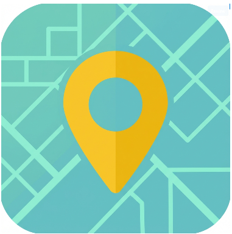
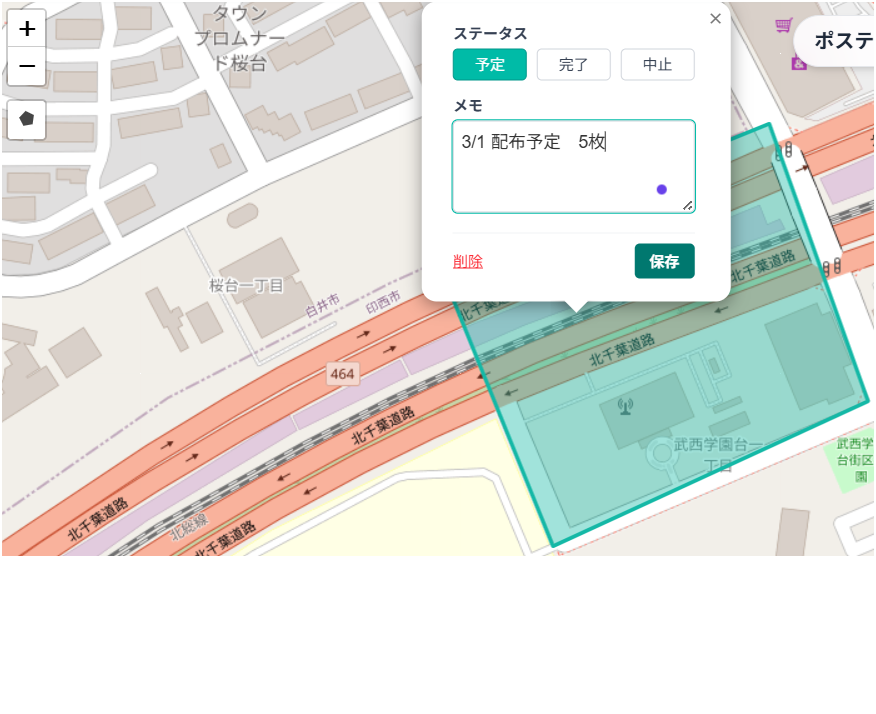
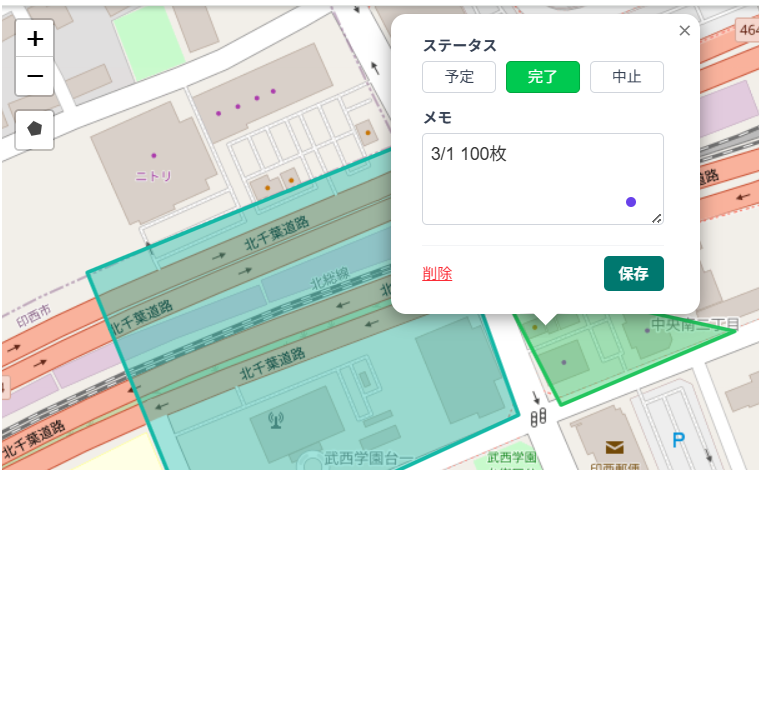
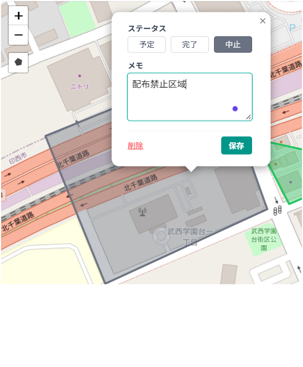

# Posting Map (ポスティング管理マップ)



ポスティング（チラシ配布）活動支援アプリです。
地図上で配布エリアを管理し、配布状況（予定・完了・中止）を可視化します。


## 主な機能
- **現在地表示**: アプリ起動時に現在地周辺の地図を自動表示し、すぐに活動を開始できます。
- **エリア作図**: 地図上に配布するエリア（多角形）を指でなぞって描画できます。
- **ステータス管理**: 各エリアを色で直感的に管理。
  - 🔵 **予定** (Planned): <br>
  - 🟢 **完了** (Completed): <br>
  - 🔘 **中止** (Cancelled): <br>
- **ゲスト利用**: Googleアカウントを持っていないユーザーも「ゲスト」として参加・編集が可能です。
- **ゲスト利用**: Googleアカウントを持っていないユーザーも「ゲスト」として参加・編集が可能です。
- **枚数管理**: 各エリアごとに「予定枚数」と「完了枚数」を数値で正確に記録できます。
- **メモ機能**: 「チラシお断りの家あり」などの注意事項を備考欄に記録できます。
- **データ管理**: 
  - **バックアップ**: 設定画面から全データをJSONファイルとして保存・復元できます。
  - **CSV連携**: スポット情報をCSV形式でエクスポート・インポート可能。Excel等での分析やデータ移行に便利です。（写真URLの出力有無や不正データの自動除外機能付き）
  - **一括削除**: 開発・テスト用に、エリアやスポットを一括削除する機能（Danger Zone）も備えています。
- **写真付きスポット登録**: アルバムから写真をアップロードして地図上にピンを立てられます。EXIF情報があれば自動で位置を特定します。
  - 写真の建物の個別情報を記録できます。（「建物名称」の入力、「配布禁止/注意事項あり/その他」の分類と関連タグが選択できます。）
- **PWA対応**: スマートフォンのホーム画面に追加することで、ネイティブアプリのように全画面で動作します。

## 開発の軌跡
開発の過程、技術的な課題、デザインの変遷などは [PROGRESS.md](./PROGRESS.md) に詳しくまとめています。

## 今後の展望 (ロードマップ)
今後の機能追加や改善計画（セキュリティ強化、CSVエクスポート、デスクトップアプリ化など）については [ROADMAP.md](./ROADMAP.md) をご覧ください。

## 技術スタック
- **Framework**: Next.js 16 (App Router)
- **Database**: Firebase Firestore (NoSQL)
- **Auth**: Firebase Authentication (Google Login)
- **Map**: React-Leaflet / Leaflet Draw
- **Styling**: Tailwind CSS (Custom Theme: Mint/Teal)
- **Deployment**: Vercel

## アーキテクチャ選定理由 (Architecture Decision Record)

### なぜ Firebase Storage ではなく Firestore なのか？
当初は大容量のデータを扱える **Firebase Storage**（ファイルストレージ）の利用も検討されましたが、最終的に **Cloud Firestore**（NoSQLデータベース）を選定しました。理由は以下の通りです。

1.  **同時編集（コンフリクト）の防止**:
    *   File Storage は「エクセルファイルの共有」に似ており、複数人が同時に編集するとデータの上書きや消失のリスクがあります。
    *   Firestore はデータベースであり、行単位・フィールド単位での更新が可能なため、チームでの同時利用に最適です。
2.  **パフォーマンスと通信量**:
    *   Storage はデータの一部だけ欲しくてもファイル全体をダウンロードする必要があります。
    *   Firestore は画面に必要なデータだけをピンポイントで取得・更新できるため、データ量が増えても高速に動作します。
3.  **将来的な拡張性 (Hybrid構成)**:
    *   将来的に写真の容量などが増えた場合でも、現在の Firestore 構成を捨てずに、「写真は Storage へ、場所データは Firestore へ」という**ハイブリッド構成**へスムーズに移行可能です。


## 使い方（簡易）
1. Googleアカウント（管理者）またはゲストでログインします。
2. 画面左上の「多角形アイコン」をタップして、地図上に配るエリアを描きます。
3. エリアをタップして「予定」「完了」「中止」などのステータスを変更し、「保存」します。
4. **写真登録**: 画面右下のカメラアイコンから、その場所の写真をアップロードして地図上にピン留めできます。（カメラアイコンからの撮影はできません。）
5. **データ管理**: 設定画面（管理者のみ）から、全データの書き出し（バックアップ）や読み込み（復元）を行えます。

## 導入・開発ガイド

このアプリは、エンジニアでない方でも簡単に導入できる「クイックスタート」と、エンジニア向けの「ローカル開発」の両方に対応しています。

### 1. クイックスタート (初心者・一般利用向け)　※現在あまり初心者向けになっていないので随時改善中です。すみません。20260108作者
詳細な知識がなくても、以下の「Deploy」ボタンからこのアプリをローカルPCにセットアップできます。
※ 事前にGoogleアカウントとGitHubアカウントの作成が必要です。

[](https://vercel.com/new/clone?repository-url=https%3A%2F%2Fgithub.com%2Fcalico-blanket%2Fposting-map)

1.  **Deployボタンをクリック**: GitHubリポジトリの作成とVercelへのデプロイが自動で始まります。
2.  **デプロイ完了**: Vercelの完了画面に表示されるリンクからアプリを開きます。
3.  **セットアップウィザード**: アプリを開くと案内画面（ウィザード）が表示されます。指示に従ってFirebaseの設定を行ってください。
    - ウィザードの最後に、本番運用に必要な環境変数（Vercel用）も案内されます。

### 2. ローカル開発手順 (エンジニア向け)
ソースコードを手元で編集・実行するための手順です。

#### 前提条件
- Node.js 18以上
- Git

#### 手順
1. **リポジトリのクローン**
   ```bash
   git clone https://github.com/calico-blanket/posting-map.git
   cd posting-map
   ```

2. **依存関係のインストール**
   ```bash
   npm install
   ```

3. **環境変数の設定**
   ルートディレクトリに `.env.local` ファイルを作成し、以下の変数を設定してください。

   ```bash
   NEXT_PUBLIC_FIREBASE_API_KEY=your_api_key
   NEXT_PUBLIC_FIREBASE_AUTH_DOMAIN=your_project.firebaseapp.com
   NEXT_PUBLIC_FIREBASE_PROJECT_ID=your_project_id
   NEXT_PUBLIC_FIREBASE_STORAGE_BUCKET=your_project.appspot.com
   NEXT_PUBLIC_FIREBASE_MESSAGING_SENDER_ID=your_sender_id
   NEXT_PUBLIC_FIREBASE_APP_ID=your_app_id
   NEXT_PUBLIC_ADMIN_EMAILS=admin@example.com,another@example.com
   ```
   ※ Firebase Console の「プロジェクトの設定」から取得できます。

4. **開発サーバーの起動**
   ```bash
   npm run dev
   ```
   http://localhost:3000 で起動します。

## ライセンス
このプロジェクトは [MIT License](./LICENSE) のもとで公開されています。
This project is licensed under the MIT License - see the [LICENSE](./LICENSE) file for details.

## 作者
猫柄毛布（calico-blanket）

## 使用AI
Antigravitiy
